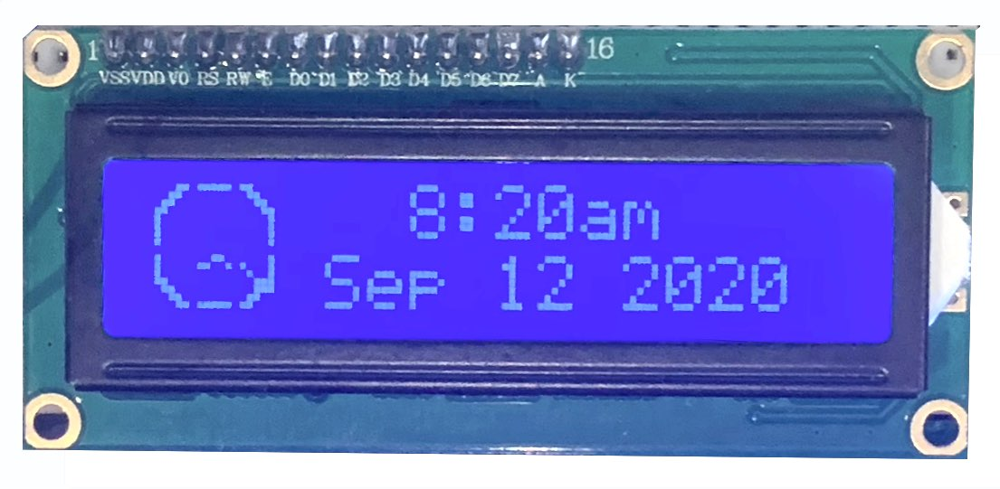
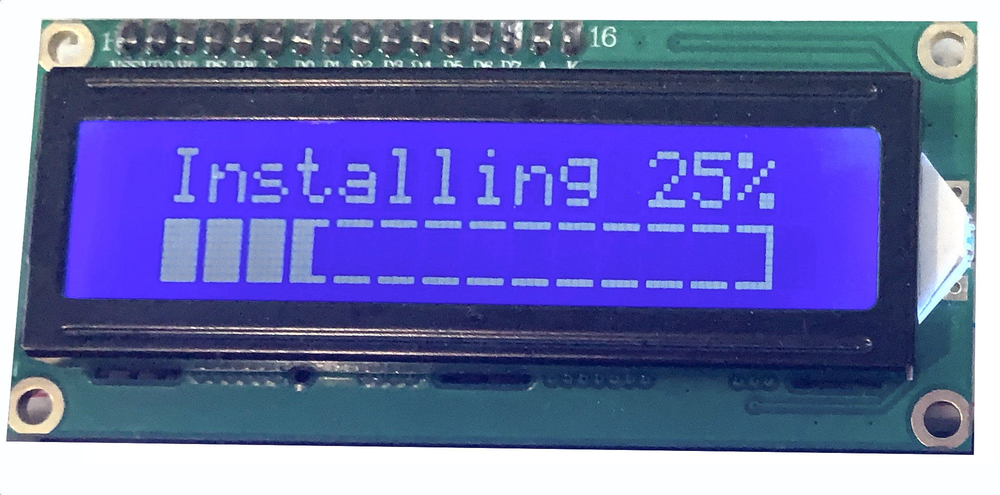

HD44780
=======

Introduction
------------
The HD44780 is sufficiently different from the other supported LCD displays to
warrant a dedicated page to describe its features (and limitations).

It is a very popular LCD display that is widely available, cheap and
available in several form factors with 16 character x 2 line and 20 character
by 4 line displays the most common.  As with most LCD displays, it comes with
a backlight which ``luma.lcd`` can control using a GPIO pin.  PWM modulation
is supported if varying the intensity of the backlight is desired.

They are normally connected to SBCs using a parallel 6800-series interface
implemented bitbang-style using the SBCs GPIO pins.  Alternatively, they are
also sold pre-connected to a few different I2C backpacks including the
PCF8574, MCP23008 and MCP23017 I2C expanders.

.. Note:
  Currently ``luma.core`` only supports the ``bitbang_6800`` and ``pcf8574`` interfaces

Capabilities
------------
The HD44780 is mainly a character-based device and can be purchased with different
font tables installed in its ROM.  The two most popular are the A00 ROM (English/Japanese)
and the A02 ROM (English/European).  See :download:`HD44780 <tech-spec/HD44780.pdf>`
for details on which characters are included in each.

In addition to the built-in characters, HD44780s can have up to eight custom
written into their RAM.  This feature is used by ``luma.lcd`` to provide a limited
graphics capability.

Character-mode Usage
~~~~~~~~~~~~~~~~~~~~
When using :py:class:`luma.lcd.device.hd44780` the most common way of controlling
the display is to use the `text` property which operates similarly to the
:py:class:`luma.core.virtual.sevensegment` wrapper class.  To use it, assign the
`text` property a string containing the values that you want displayed.

.. code:: python

  from luma.core.interface.parallel import bitbang_6800
  from luma.lcd.device import hd44780

  interface = bitbang_6800(RS=7, E=8, PINS=[25, 24, 23, 27])
  device = hd44780(interface)

  device.text = 'Hello World'

The newline character can be used to display characters on the next line of the
display.

.. code:: python

  device.text = 'Hello\nWorld'

It is the only control character that works however.  Other control characters
such as carriage return (ascii 13) and line feed (ascii 10) will be silently
ignores.

.. note:
  Unlike sevensegment's text property which throws an exception if you exceed
  the bounds of the display, there is no bounds checking on the displayed text.
  If you exceed a line boundary it will not wrap to the next line and content
  below the lowest line on the device will not be displayed.

Graphics-mode Usage
~~~~~~~~~~~~~~~~~~~
It is also possible to display graphical content using the `display` method
which works similarly to other ``luma.lcd`` and ``luma.oled`` displays.  However
there is a significant limitation.  There can only be 8 characters worth of 'custom'
content displayed at any point in time.  If you exceed this limit, the ``undefined``
character (a value set during initialization of the hd44780) will be displayed
instead.  While 8 custom characters may seem limited, with some creativity it can
be very useful.

To understand how to leverage this capability requires some explanation of
how the screen of the display is organized and how ``luma.lcd`` manages the
custom character space.

Each character position on an HD44780 display is made up of a 5 pixel by 8 pixel
grid.  When a character is requested to be displayed, the HD44780 looks up the
character from its font table and copies the pixels from the font table ROM to the
address in RAM that corresponds to the current character position.  If there is
not a character within the font table that matches what needs to be displayed,
a custom character can be created within a small space in the display's RAM that
is reserved for this purpose.  There are several restrictions that have to be
kept in mind though.

* The custom character must be a 5x8 image
* It can only be displayed in alignment with the other characters on the display
* There can be a maximum of 8 special characters on the screen at any given time
* If the driver has run out of custom characters for a screen, the remaining cells
  with non-standard content will display the `undefined` character instead.

However there are a few features that can be leveraged to extend beyond these
restrictions.

* The HD44780 class will automatically create the appropriate custom characters
* The content of a special character can be used multiple times on the screen
* The content of all of the special characters can be changed every time the
  screen is redrawn.

Here is a small example of how this can be leveraged.

.. code:: python

  from luma.core.interface.parallel import bitbang_6800
  from luma.lcd.device import hd44780
  from luma.core.render import canvas
  from PIL import Image, ImageDraw

  interface = bitbang_6800(RS=7, E=8, PINS=[25, 24, 23, 27])
  device = hd44780(interface)

  def progress_bar(width, height, percentage):
    img = Image.new('1', (width, height))
    drw = ImageDraw.Draw(img)
    drw.rectangle((0, 0, width-1, height-1), fill='black', outline='white')
    drw.rectangle((0, 0, width*percentage, height-1), fill='white', outline='white')
    return img

  progress = 0.25
  fnt = device.get_font('A00')
  with canvas(device) as draw:
    draw.text( (5,0), f'Installing {progress*100:.0f}%', font=fnt, fill='white')
    draw.bitmap( (5,8), progress_bar(70, 8, progress), fill='white')

There are a few of things that deserve highlighting in this code.

* We have used the hd44780 classes ``get_font`` method to retrieve the internal
  font used by the device.  This enables us to place exact replicas of the
  characters within the font tables on the canvas.  When these characters are
  displayed, because they are already normal characters, they do not consume any
  of the customer character RAM.  The hd44780 class contains both the A00 and A02
  font tables.  You should request the table that matches what is installed in
  your display.

* The progress bar is drawn using normal :mod:`PIL.ImageDraw` primitives in this case a
  couple of calls to the ``rectangle`` method and a call to the ``text`` method.

* The size of the progress bar was carefully chosen.  It is 70 pixels wide by 8
  pixels high.  This will fill 14 characters worth of space.  This is because
  each cell is 5 pixels wide (70/5=14) and it is 8 pixels high (8/8=1).
  Normally 14 cells worth of graphical content would be a problem. However, the
  progress bar only requires four custom characters regardless of what position
  the progress value is set to.  To see why that is you need to look at what each
  cell looks like within the progress bar at each state the progress bar.

  The different conditions of the progress bar can be expressed in 5 states:

  .. csv-table:: **CUSTOM CHARACTERS**
    :header: "First", "Middle", "End"
    :widths: 20, 20, 20

      "Left Empty", "Middle Empty", "Right Empty"
      "Filling", "Middle Empty", "Right Empty"
      "Filled", "Filling, Middle Empty", "Right Empty"
      "Filled", "Filled, Filling, Middle Empty", "Right Empty"
      "Filled", "Filled", "Right Filling"
      "Filled", "Filled", "Filled"

  So the maximum number of custom characters is as little as one but never exceeds four.

* The progress bar was carefully placed to align with the character cell
  boundaries.  If we had placed the progress bar image one pixel to the left
  if would have consumed two additional custom characters as the beginning and
  end of the progress bar would be spread across character cell boundaries.  In
  this particular case, it would still have displayed correctly because we would
  be under the 8 character limit.

.. tip::
  When displaying text, to avoid using custom character space you should:
    * Use the internal font installed in your device which can be retrieved using
      ``get_font``
    * Make sure to align the placement of the text to the 5x8 cell structure of
      the display

      Good::

        draw.text( (5,0), 'Good', fill='white' font=device.get_font('A00'))

      Bad::

        draw.text( (6,1), 'Bad', fill='white' font=device.get_font('A00'))

Embedded Font Tables
~~~~~~~~~~~~~~~~~~~~
The :py:class:`luma.lcd.device.hd44780` class leverages
:py:mod:`luma.core.bitmap_font` to include two fonts that replicate the two font
tables that are commonly available for the hd44780.  These are:

===========  ==================
Font Table   Font Name
===========  ==================
A00          English Japanese
A02          English European
===========  ==================

You can retrieve either of these fonts using the ``get_font`` method.

.. code:: python

  fnt = device.get_font('A02')

You can also combine fonts together in order to display characters not included
within your device's character table.

As an example, the 'Black Right-Pointing Triable' symbol ``Unicode U+25b6`` is not
contained in the A00 character table but is frequently used as a 'Play' symbol for
multi-media systems.  It is however included in the A02 font table.  We can
pull the symbol from A02 and add it to the current embedded font to enable us to
use it.

.. code:: python

  fnt = device.get_font('A02')
  device.font.combine(fnt, '\u25b6')
  device.text = '\u25b6 Play'

This feature leverages the custom character capability so it has the same 8
character limitation.  If you exceed 8 characters within a screen, the ``undefined``
character will be used for all additional characters that are not contained
within the devices font table.

See the documentation for :py:mod:`luma.core.bitmap_font` for more information on
how to use the ``bitmap_font`` module.
