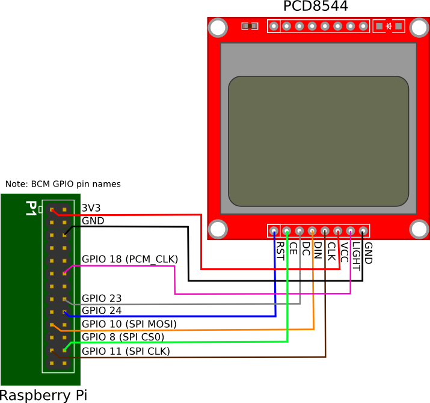

Hardware
--------

Tips for connecting the display
^^^^^^^^^^^^^^^^^^^^^^^^^^^^^^^
* If you don't want to solder directly on the Pi, get 2.54mm 40 pin female
  single row headers, cut them to length, push them onto the Pi pins, then
  solder wires to the headers.

* If you need to remove existing pins to connect wires, be careful to heat
  each pin thoroughly, or circuit board traces may be broken.

* Triple check your connections. In particular, do not reverse VCC and GND.

Pre-requisites
^^^^^^^^^^^^^^
The GPIO pins used for this SPI connection are the same for all versions of the
Raspberry Pi, up to and including the Raspberry Pi 3 B.

   
========== ====== ============ ======== ==============
LCD Pin    Name   Remarks      RPi Pin  RPi Function
========== ====== ============ ======== ==============
1          RST    Reset        P01-18   GPIO 24 
2          CE     Chip Enable  P01-24   GPIO 8 (CE0)
3          DC     Data/Command P01-16   GPIO 23
4          DIN    Data In      P01-19   GPIO 10 (MOSI)
5          CLK    Clock        P01-23   GPIO 11 (SCLK)
6          VCC    +3.3V Power  P01-01   3V3
7          LIGHT  Backlight    P01-12   GPIO 18 (PCM_CLK)
8          GND    Ground       P01-06   GND
========== ====== ============ ======== ==============

.. warning::
   There appears to be varying pin-out configurations on different PCD8544 modules - beware!

.. note::

  * If you're already using the listed GPIO pins for Data/Command and/or Reset,
    you can select other pins and pass a ``bcm_DC`` and/or a ``bcm_RST``
    argument specifying the new *BCM* pin numbers in your serial interface create
    call.

  * Because CE is connected to CE0, the display is available on SPI port 0. You
    can connect it to CE1 to have it available on port 1. If so, pass
    ``port=1`` in your serial interface create call.

Enable the SPI port::

  $ sudo raspi-config
  > Advanced Options > A6 SPI

If ``raspi-config`` is not available, enabling the SPI port can be done
`manually <http://elinux.org/RPiconfig#Device_Tree>`_.

Ensure that the SPI kernel driver is enabled::

  $ ls -l /dev/spi*
  crw-rw---- 1 root spi 153, 0 Nov 25 08:32 /dev/spidev0.0
  crw-rw---- 1 root spi 153, 1 Nov 25 08:32 /dev/spidev0.1

or::

  $ lsmod | grep spi
  spi_bcm2835             6678  0

Then add your user to the *spi* and *gpio* groups::

  $ sudo usermod -a G spi pi
  $ sudo usermod -a G gpio pi

Log out and back in again to ensure that the group permissions are applied
successfully.
