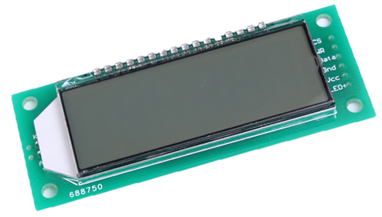
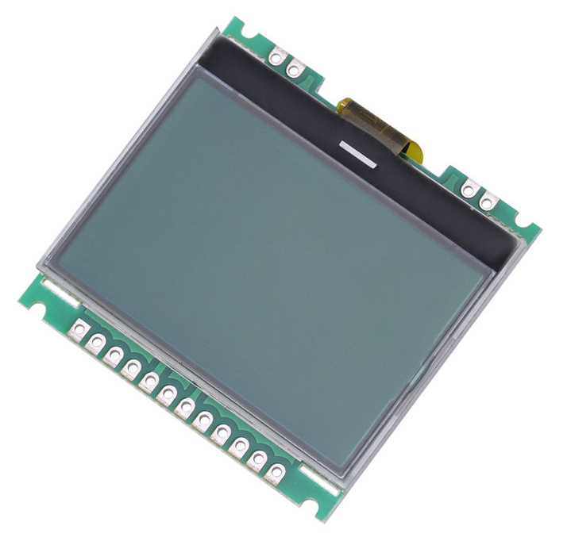
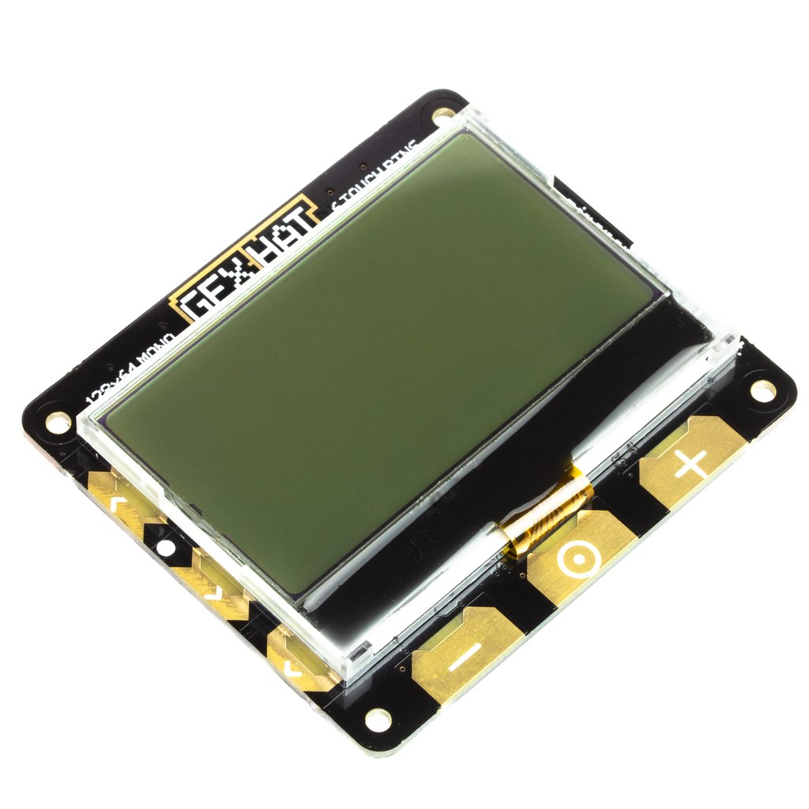

Introduction
------------
Interfacing small LCD displays with the PCD8544, ST7735, HT1621 and UC1701X
driver in Python using SPI on the Raspberry Pi and other linux-based
single-board computers: the library provides a Pillow-compatible drawing
canvas, and other functionality to support:

* scrolling/panning capability,
* terminal-style printing,
* state management,
* color/greyscale (where supported),
* dithering to monochrome

The PCD8544 display pictured below was used originally as the display for
`Nokia 5110 <https://en.wikipedia.org/wiki/Nokia_5110>`_ mobile phones,
supporting a resolution of 84 x 48 monochrome pixels and a switchable
backlight:

.. image:: images/pcd8544.png

They are now commonly recycled, and sold on ebay with a breakout board and SPI
interface.

The ST7735 display supports a resoltion of 160 x 128 RGB pixels (18-bit / 262K
colors) with a switchable backlight:

.. image:: images/st7735.jpg

The HT1621 display (as purchased) supports six 7-segment characters with a
switchable backlight:

The UC1701X display supports a resolution of 128 x 64 monochrome pixels with a
switchable backlight:

The ST7567 display supports a resolution of 128 x 64 monochrome pixels:

.. seealso::
   Further technical information for the specific device can be found in the
   datasheet below: 
   
   - :download:`PCD8544 <tech-spec/PCD8544.pdf>`
   - :download:`ST7735 <tech-spec/ST7735.pdf>`
   - :download:`HT1621 <tech-spec/HT1621.pdf>`
   - :download:`UC1701X <tech-spec/UC1701X.pdf>`

As well as display drivers for the physical device, there are emulators that
run in real-time (with pygame) and others that can take screenshots, or
assemble animated GIFs, as per the examples below (source code for these is
available in the `examples <https://github.com/rm-hull/luma.examples>`_
repository.
