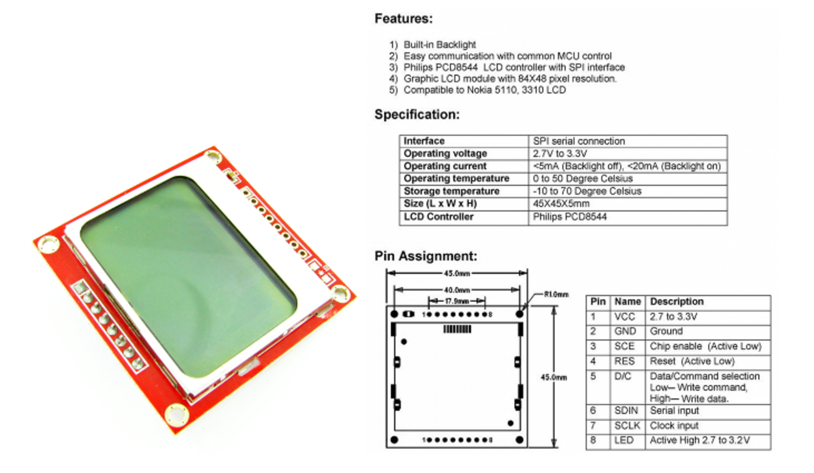
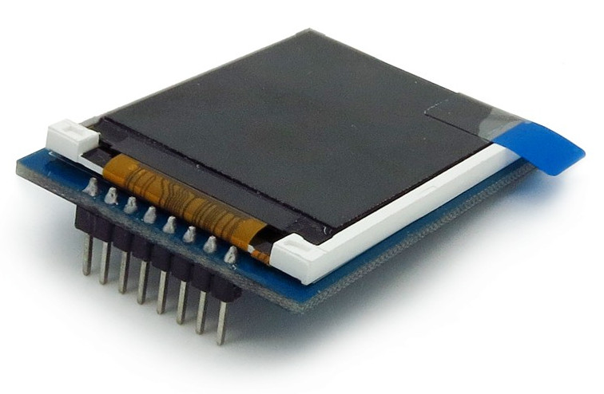

Introduction
============
luma.lcd provides a Python3 interface to small LCD displays connected to
Raspberry Pi and other Linux-based single-board computers (SBC).  It provides a
Pillow-compatible drawing canvas, and other functionality to support:

* scrolling/panning capability,
* terminal-style printing,
* state management,
* color/greyscale (where supported),
* dithering to monochrome

Supported Devices
-----------------
The library currently supports devices using the HD44780, PCD8544, ST7735, HT1621,
and UC1701X controllers.

HD44780
~~~~~~~
The HD44780 (and similar) devices are some of the most popular small LCD
displays available for SBCs.  These are character-based displays but the luma.lcd
driver supports a limited ability to display graphical content on them.  See the
:doc:`HD44780` documentation for details.

.. image:: images/hd44780_20x4.jpg

PCD85744
~~~~~~~~
The PCD8544 display pictured below was used originally as the display for
`Nokia 5110 <https://en.wikipedia.org/wiki/Nokia_5110>`_ mobile phones,
supporting a resolution of 84 x 48 monochrome pixels and a switchable
backlight:

They are now commonly recycled, and sold on ebay with a breakout board and SPI
interface.

ST7735
~~~~~~
The ST7735 display supports a resoltion of 160 x 128 RGB pixels (18-bit / 262K
colors) with a switchable backlight:

HT1621
~~~~~~
The HT1621 display (as purchased) supports six 7-segment characters with a
switchable backlight:

UC1701X
~~~~~~~
The UC1701X display supports a resolution of 128 x 64 monochrome pixels with a
switchable backlight:

ST7567
~~~~~~
The ST7567 display supports a resolution of 128 x 64 monochrome pixels:

.. image:: images/st7567.jpg

.. seealso::
   Further technical information for the specific device can be found in the
   datasheet below:

   - :download:`PCD8544 <tech-spec/PCD8544.pdf>`
   - :download:`ST7735 <tech-spec/ST7735.pdf>`
   - :download:`HT1621 <tech-spec/HT1621.pdf>`
   - :download:`UC1701X <tech-spec/UC1701X.pdf>`
   - :download:`ILI9341 <tech-spec/ILI9341.pdf>`
   - :download:`HD44780 <tech-spec/HD44780.pdf>`

Examples and Emulators
----------------------
As well as display drivers for the physical device, there are emulators that
run in real-time (with pygame) and others that can take screenshots, or
assemble animated GIFs, as per the examples below (source code for these is
available in the `examples <https://github.com/rm-hull/luma.examples>`_
repository.

.. image:: images/clock_anim.gif
   :alt: clock

.. image:: images/invaders_anim.gif
   :alt: invaders

.. image:: images/crawl_anim.gif
   :alt: crawl

.. _Pillow: https://pillow.readthedocs.io
.. _pygame: https://www.pygame.org
